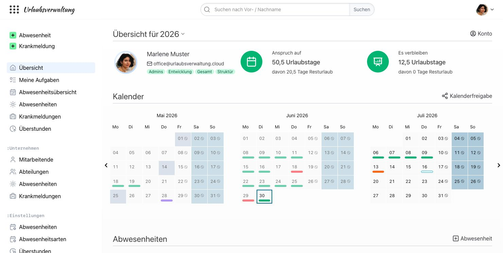

# focus:shift

  

Welcome to the GitHub home of [**focus:shift**](https://focus-shift.de), the open-source, GDPR-compliant suite for **leave management** (Urlaubsverwaltung) and **time tracking** (Zeiterfassung). *Time for what matters.*

We help teams manage **leave requests**, **sick notes**, **overtime** and **working hours**. You can use our hosted cloud service or run the software yourself.

## Care built in

[**Fürsorge**](https://focus-shift.de/fuersorge/) (care) is the idea behind focus:shift. It uses the working-time and absence data you already record to show signs of overload **early**. There is no extra tracking, no questionnaires, and no rating of individual employees. The aim is prevention rather than reaction, and mindfulness rather than surveillance.

## Features

* **[Time tracking](https://focus-shift.de/software/#arbeitszeiterfassung):** clock in/out, a stopwatch and breaks, flexible working-time models, reports and CSV export
* **[Custom absence types](https://focus-shift.de/software/#abwesenheitsarten):** home office, training, rehab and more, each with optional approval workflows and its own color
* **[Team overview](https://focus-shift.de/software/#teamuebersicht) and [calendar view](https://focus-shift.de/software/#kalender):** see absences across departments at a glance
* **[Calendar integration](https://focus-shift.de/software/#kalenderintegration):** iCal subscriptions for Google Calendar, Outlook and other calendar apps
* **[Sick notes](https://focus-shift.de/software/#krankmeldungen) and [overtime](https://focus-shift.de/software/#ueberstunden):** reports and overtime accounts that respect privacy
* **[Single sign-on](https://focus-shift.de/software/#single-sign-on):** OpenID Connect with Microsoft Entra ID, Google Workspace, Okta, Auth0 and others
* **[Mobile app](https://focus-shift.de/software/#focusapp)** for [iOS](https://apps.apple.com/de/app/urlaubsverwaltung-cloud/id6747396834) and [Android](https://play.google.com/store/apps/details?id=cloud.urlaubsverwaltung.mobile.urlaubsverwaltung): request absences, track time, and approve requests on the go

## Try it hosted

Skip the setup and **use focus:shift in the cloud**. We host it in an ISO 27001-certified data center in Germany, with encrypted connections and backups, so there are no servers for you to maintain and you always run the latest version.

* **[Start your free 30-day trial](https://registry.apps.urlaubsverwaltung.cloud/registration)**
* **Try the live demo** without signing up, as [user](https://urlaubsverwaltung.demo.urlaubsverwaltung.cloud/oauth2/authorization/oidc?login_hint=user), [boss](https://urlaubsverwaltung.demo.urlaubsverwaltung.cloud/oauth2/authorization/oidc?login_hint=boss) or [office](https://urlaubsverwaltung.demo.urlaubsverwaltung.cloud/oauth2/authorization/oidc?login_hint=office)
* See the [pricing](https://focus-shift.de/software/#preis) or [book a personal demo](https://focus-shift.de/demo/#termin-vereinbaren)

## Core Projects

All our software is [open source](https://focus-shift.de/software/#open-source). You can run it yourself at any time, so you are never locked in to a vendor, including us.

* [**urlaubsverwaltung**](https://github.com/urlaubsverwaltung/urlaubsverwaltung): our leave management application for vacation requests, absences, sick notes and, optionally, overtime.
* [**zeiterfassung**](https://github.com/urlaubsverwaltung/zeiterfassung): our time tracking application, which helps you meet the legal requirements for recording working hours.
If you need help running your own installation, we offer [on-premise installation and support](https://focus-shift.de/software/#preis).

## Help & Contact

* [Documentation](https://focus-shift.de/hilfe/#dokumentation) and [FAQ](https://focus-shift.de/hilfe/#faq)
* [Blog](https://focus-shift.de/neuigkeiten/blog/#posts) and [product updates](https://focus-shift.de/neuigkeiten/update/#posts)
* Feature requests and bug reports: [GitHub Issues](https://github.com/urlaubsverwaltung/urlaubsverwaltung/issues)
* Email: [support@focus-shift.de](mailto:support@focus-shift.de) · Phone: [+49 721 98614542](tel:+4972198614542)
* [LinkedIn](https://www.linkedin.com/company/focus-shift-software)

  Made with ❤️ in Karlsruhe by the <a href="https://focus-shift.de/wir/">focus:shift team</a>.

